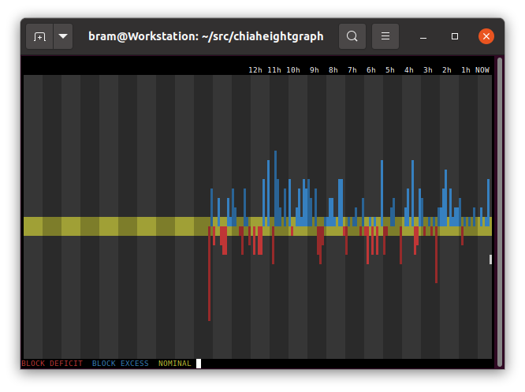

# Chia Height Graph
Monitor for Chia Block Height




## Introduction

The chiaheightgraph tool will graph Chia Block Height changes in a linux terminal. Use a 24-bit colour terminal, like xterm or gnome-terminal.


## Building

```
$ git clone https://github.com/stolk/chiaheightgraph.git

$ cd chiaheightgraph

$ make
```

## Launching

To use it:

Set the loglevel for Chia to **INFO** by editting `~/.chia/mainnet/config/config.yaml` and make sure you have `log_level: INFO` set.

Then do:

**$ ./chiaheightgraph ~/.chia/mainnet/log**

Leave the tool running, as it keeps checking the log. More pixels will scroll in from the right, plotting top to bottom.

## Rationale

If your full node is not in sync, your block heights are not steadily increasing. This tool graphs the block height to find issues with the full node.

## Function

The debug log will contain lines that look like:
```
🌱 Updated peak to height 305755, weight 26951920, hh 0bec5b24604b76d6665c4e2daae1772bc37186d91e9146cf75f1ce2f747996f7, forked at 305754, rh: f55d8d2daa85b4d6399e79101d9bfefa2d8a8921fef1cd705fb9b583d3bbfa26, total iters: 989354550375, overflow: False, deficit: 11, difficulty: 484, sub slot iters: 114819072, Generator size: 1667, Generator ref list size: 1
```

A properly working full node should be outputting that line every 10 seconds or so to the log file (provided the log level is INFO.)

This tool will look for those lines in the logs.

The graph spans from the right of the terminal (NOW) to the left of the terminal (PAST) and every shaded band represents one hour, and every vertical line, one quarter of an hour.

Successive red bars, means your block-height has been lacking updates, and indicate a synchronization issue.

The blue bars are just your node catching up.

In a perfectly tuned system, the bars are short, although variance means they will always be some. But a graph going **and staying** red is a sign of issues.

**NOTE:** You can see more days of the week by simply resizing your terminal to be wider.

**NOTE:** First time users should not be alarmed by a lot of grey colour on the left side of the screen. Chia logs are at most 7 x 20MB, and because a full node spams a lot, there are only a few hrs of info in there. 

## Colours

Blue: the full node saw more new blocks than expected, during this time span.

Red: the full node saw fewer new blocks than expected, during this time span.

Yellow: the rate of new blocks in nominal.

If you see a large red peak down followed by a large blue peak up, it means that the new blocks came in delayed.


## Keys

Press ESCAPE or Q to exit chiaheightgraph.

## Environment Variables

If you have more than 8 recycled debug.log files, then you can tell the tool to read more of them:
```
$ NUM_DEBUG_LOGS=15 ./chiaheightgraph ~/.chia/mainnet/logs
```

## Did you know that...

* Chia Height Graph has a companion tools called [Chia Plot Graph](https://github.com/stolk/chiaplotgraph)
and [Chia Harvest Graph](https://github.com/stolk/chiaharvestgraph)


## Donations

Chia Height Graph is a tool by Bram Stolk, who is on Twitter as: @BramStolk where he mostly tweets about game development.

If you find this tool useful, donations can go to XCH wallet:
xch1zfgqfqfdse3e2x2z9lscm6dx9cvd5j2jjc7pdemxjqp0xp05xzps602592

## Known issues

* Shows garbage on terminals that do not support 24 bit colour.
* Missing manual page.
* It looks [weird](https://imgur.com/a/GkzPie2) when going through an old version of putty.

## Copyright

chiaheightgraph is (c)2021 by Bram Stolk and licensed under the MIT license.
